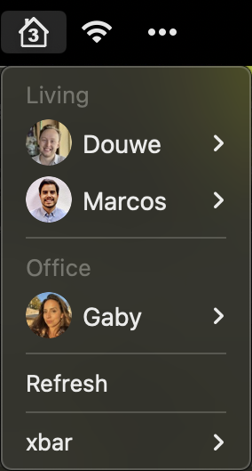

# XBar + UniFi = Who's Home?

[XBar](https://xbarapp.com) plugin that shows all smartphones on a [UniFi](https://www.ui.com/wi-fi) network in your macOS menu bar.

Devices are grouped by WiFi access point.
[AP aliases](#aliases) can be configured to map an AP name or MAC address to a room name, or to merge different APs into one room.

Device aliases can be configured in the UniFi Network UI.
Generic prefixes and suffixes are filtered out to derive the owner's name, e.g. `Douwe's iPhone` becomes `Douwe`.

[Device avatars](#avatars) can be configured using a [Gravatar](https://gravatar.com) email or image URL.

Optionally, you can [get notified](#event-notifications) when phones connect, roam, or disconnect, either in the menu bar or via macOS notifications.

PS. To see these smartphones in your iOS Home app as well, check out [Homebridge + UniFi = Occupancy](https://github.com/DouweM/homebridge-unifi-occupancy).

## Screenshot



## Installation

### Install dependencies

- Python 3: pre-installed on macOS
- [`pyunifi`](https://pypi.org/project/pyunifi): `pip3 install pyunifi`
- [`aiohttp`](https://pypi.org/project/aiohttp): `pip3 install aiohttp`

### Install `whos-home-unifi`

1. Open XBar Plugin Browser: any xbar menu bar item > "xbar" > "Plugin browser..."
2. Under "Categories", select "Tools"
3. Find "Who's Home? (for UniFi)"
4. Click "Install"

#### Manual (if not found in XBar Plugin Browser)

Download [`whos-home-unifi.1m.py`](./whos-home-unifi.1m.py) and move it into your XBar plugin folder (default: `~/Library/Application Support/xbar/plugins`).

### Configure

1. Open XBar Plugin Browser: any xbar menu bar item > "xbar" > "Plugin browser..."
2. Under "Plugins", select `whos-home-unifi.1m.py`
3. Configure in the panel
4. Click "refresh the plugin"

#### Manual (if not found in XBar Plugin Browser)

Create `whos-home-unifi.1m.py.vars.json` in your XBar plugin folder (default: `~/Library/Application Support/xbar/plugins`) with the following content:

```json
{
  "VAR_CONTROLLER_HOST": "192.168.1.1",
  "VAR_CONTROLLER_PORT": 443,
  "VAR_CONTROLLER_USERNAME": "<username>",
  "VAR_CONTROLLER_PASSWORD": "<password>",
  "VAR_CONTROLLER_SSL_VERIFY": false,
  "VAR_CONTROLLER_VERSION": "UDMP-unifiOS",

  "VAR_ACCESS_POINT_ALIASES": "Dream Machine=Living;Office nanoHD=Office;Bedroom nanoHD=Bedroom;Roof FlexHD=Rooftop",

  "VAR_AVATARS": "<Name>=<Gravatar email>;<Name>=<image URL>",
  "VAR_CLOUDIMAGE_TOKEN": "",

  "VAR_MENU_BAR_EVENTS": false,
  "VAR_TERMINAL_NOTIFIER_PATH": "",
  "VAR_NOTIFY_CONNECT": true,
  "VAR_NOTIFY_ROAM": false,
  "VAR_NOTIFY_DISCONNECT": true
}
```

## Settings

### UniFi Controller
- `VAR_CONTROLLER_HOST`:        Host of UniFi Controller (default: `"192.168.1.1"`)
- `VAR_CONTROLLER_USERNAME`:    Username for UniFi Controller (default: `"admin"`)
- `VAR_CONTROLLER_PASSWORD`:    Password for UniFi Controller (default: `"admin"`)
- `VAR_CONTROLLER_PORT`:        Port for UniFi Controller (default: `443`)
- `VAR_CONTROLLER_VERSION`:     Version of UniFi Controller (options: UDMP-unifiOS, unifiOS, v5, v4; default: `"UDMP-unifiOS"`)
- `VAR_CONTROLLER_SSL_VERIFY`:  Verify SSL connection to UniFi Controller (default: `false`)

### Aliases
- `VAR_ACCESS_POINT_ALIASES`:   Aliases to use for access points: `<Name/MAC>=<Alias>`, separated by `;`, e.g. `Dream Machine=Living`. (default: `""`)
- Device aliases can be configured in the UniFi Network UI, e.g. set device name to `Douwe's iPhone` to show as `Douwe`.

### Avatars
- `VAR_AVATARS`:                Set Gravatar emails or image URLs for devices to enable avatars: `<Name>=<Email/URL>`, separated by `;`, e.g. `Douwe=hi@douwe.me` (default: `""`)
- `VAR_CLOUDIMAGE_TOKEN`:       Set Cloudimage.io token to show round avatars instead of square (default: `""`)

### Event notifications
- `VAR_MENU_BAR_EVENTS`:        Show connect/roam/disconnect events in menu bar (default: `false`)
- `VAR_TERMINAL_NOTIFIER_PATH`: Set path to [`terminal-notifier`](https://github.com/julienXX/terminal-notifier) to show notifications for connect/roam/disconnect events (default: `""`)
- `VAR_NOTIFY_CONNECT`:         Notify when a device connects (default: `true`)
- `VAR_NOTIFY_ROAM`:            Notify when a device roams (moves) between access points (default: `false`)
- `VAR_NOTIFY_DISCONNECT`:      Notify when a device disconnects (default: `true`)

### Debugging
- `VAR_SHOW_TEST_DEVICES`:      Show dummy devices for each configured avatar instead of real devices (default: `false`)
